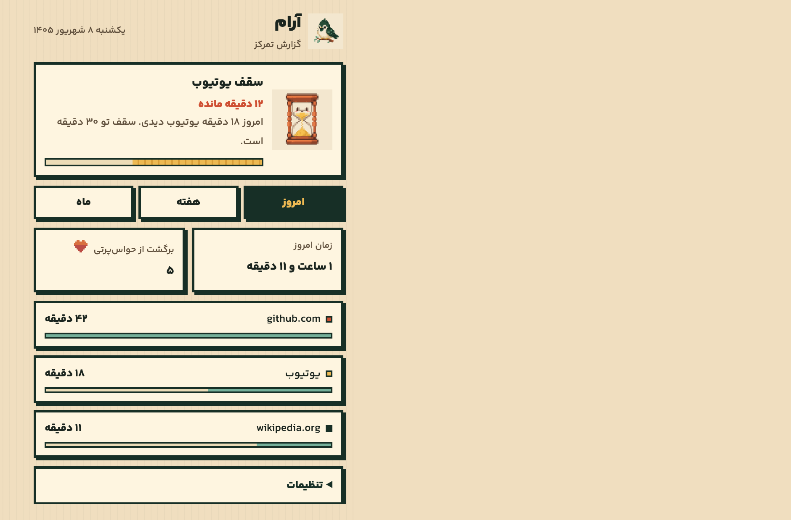
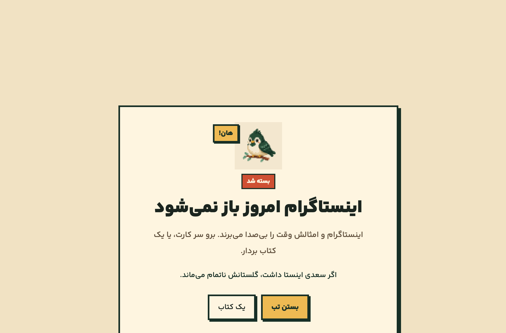
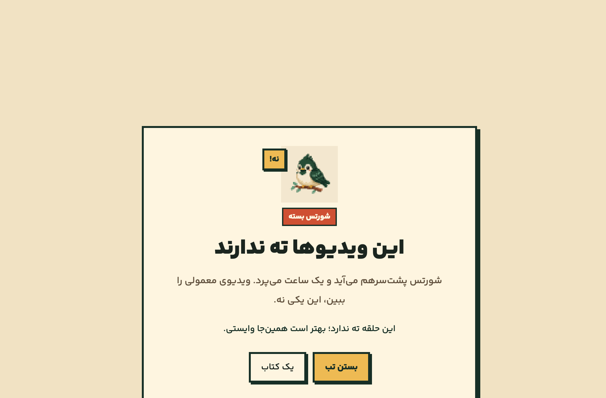
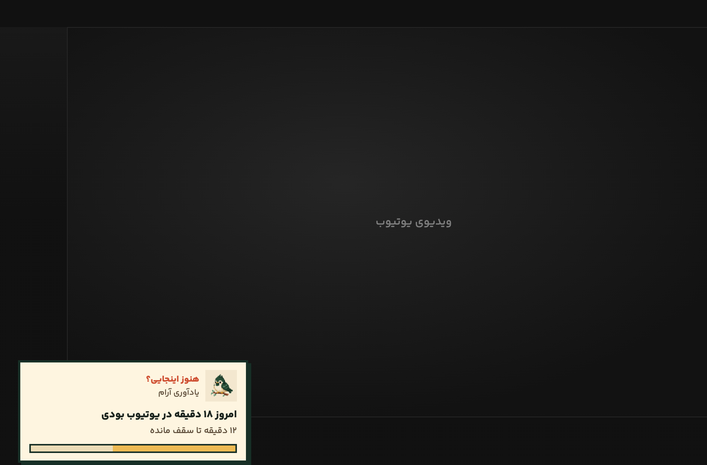
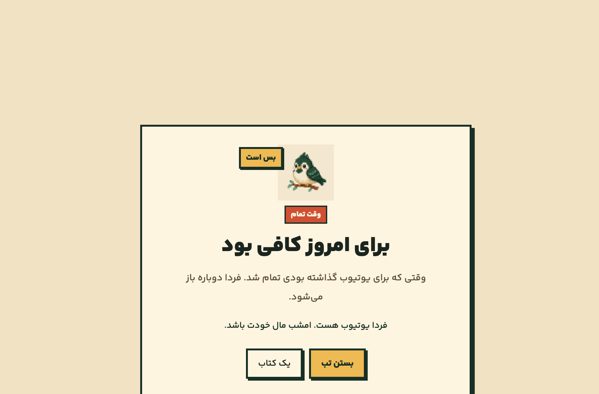

# Aram (آرام)

A personal Firefox extension that blocks social media, closes YouTube Shorts, and puts a daily cap on YouTube so attention can go back to work, books, and the rest of life.

  

## Summary

Aram never opens Instagram, Twitter, X, TikTok, or Threads. Instead of the feed, you get a short stop page that sends you back to work. YouTube Shorts are always blocked. Regular YouTube still works, but with a daily limit and a reminder that stays on the page. The toolbar popup shows where your time went today, this week, and this month.

It is not trying to block the internet. It is trying to make endless scroll hard, and getting back to work easy.

## Screenshots

When you open Instagram or Shorts, you get these pages instead of the feed:

  
  

On a normal YouTube video, a reminder stays in the corner. When the daily cap is reached, YouTube is closed until tomorrow:

  

  

## What it does

- Instagram, Twitter, X, TikTok, and Threads never load.
- URLs like `https://www.youtube.com/shorts/...` are blocked, even if you open Shorts from inside YouTube.
- On a normal YouTube video you can see how long you have been there today.
- The daily YouTube cap (default 30 minutes) closes YouTube when it is full.
- Daily, weekly, and monthly reports of the sites that took your time live in the toolbar popup.

## Temporary install in Firefox

1. Open Firefox and go to `about:debugging#/runtime/this-firefox`
2. Click **Load Temporary Add-on…**
3. Select `manifest.json` in this folder

## Settings

From the Aram popup you can change the YouTube cap, reminder interval, and extra blocked sites. The 15-minute emergency unlock only works if you type the phrase `می‌خواهم حواسم پرت شود`.
